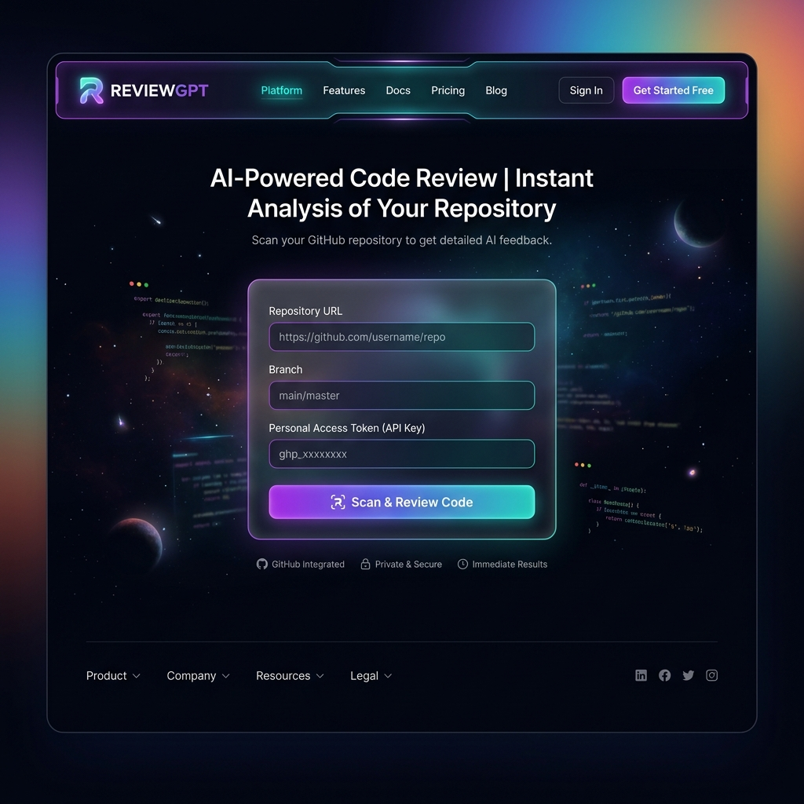
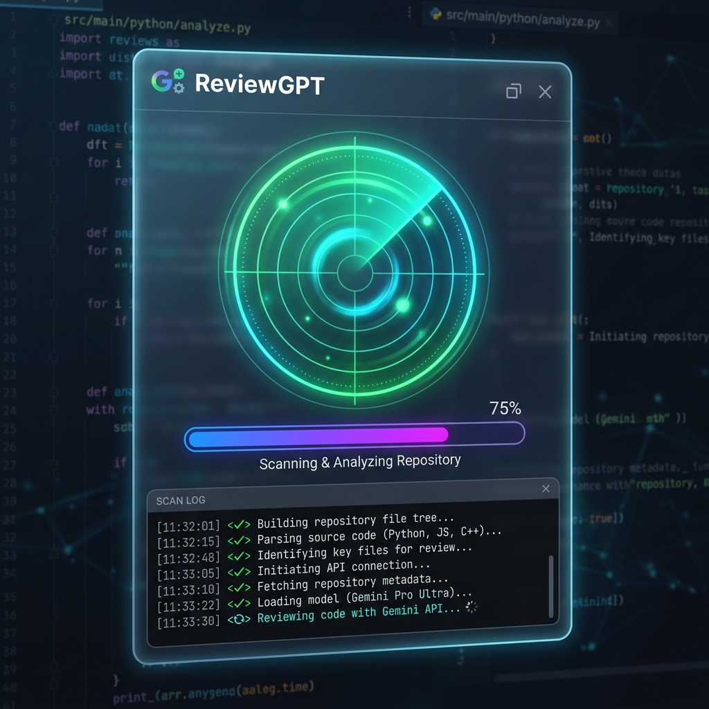
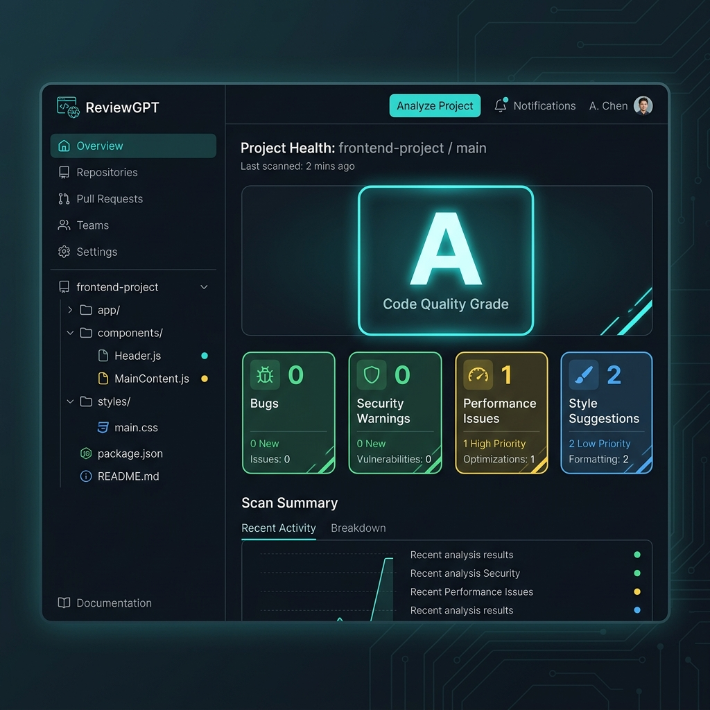
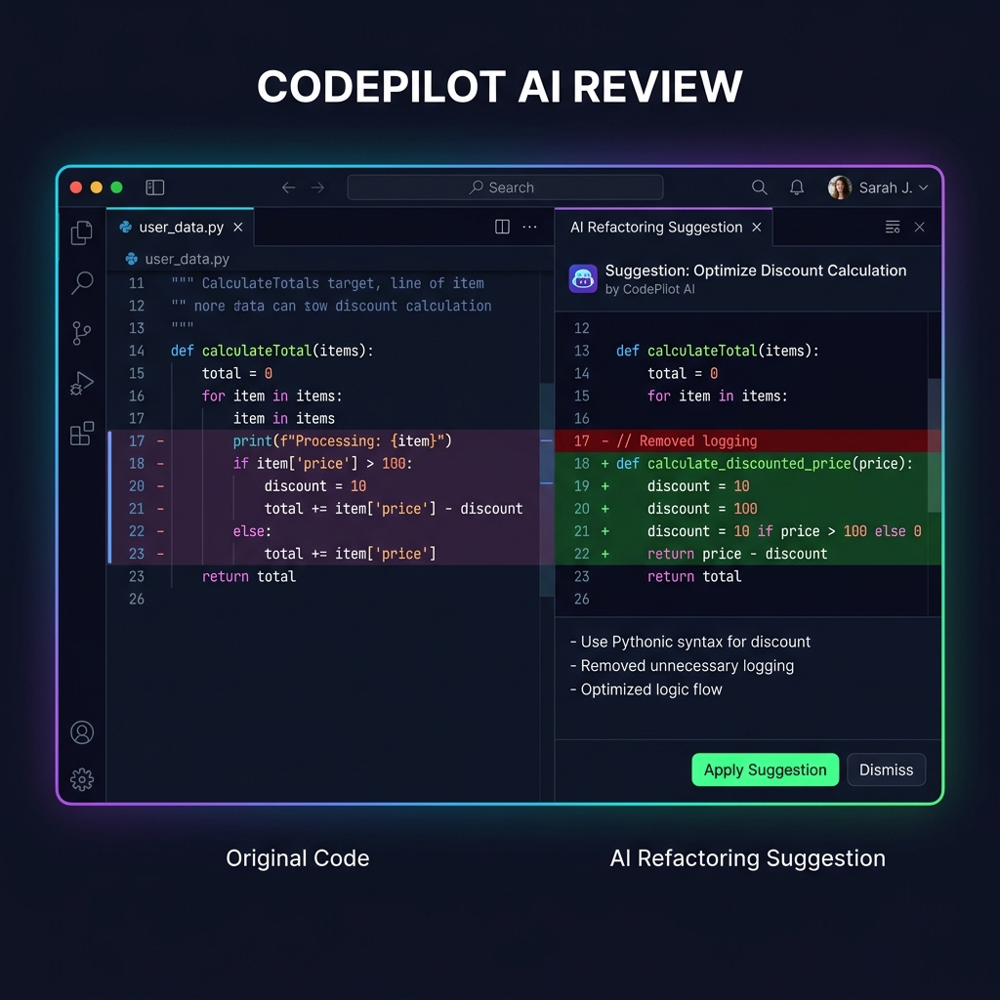
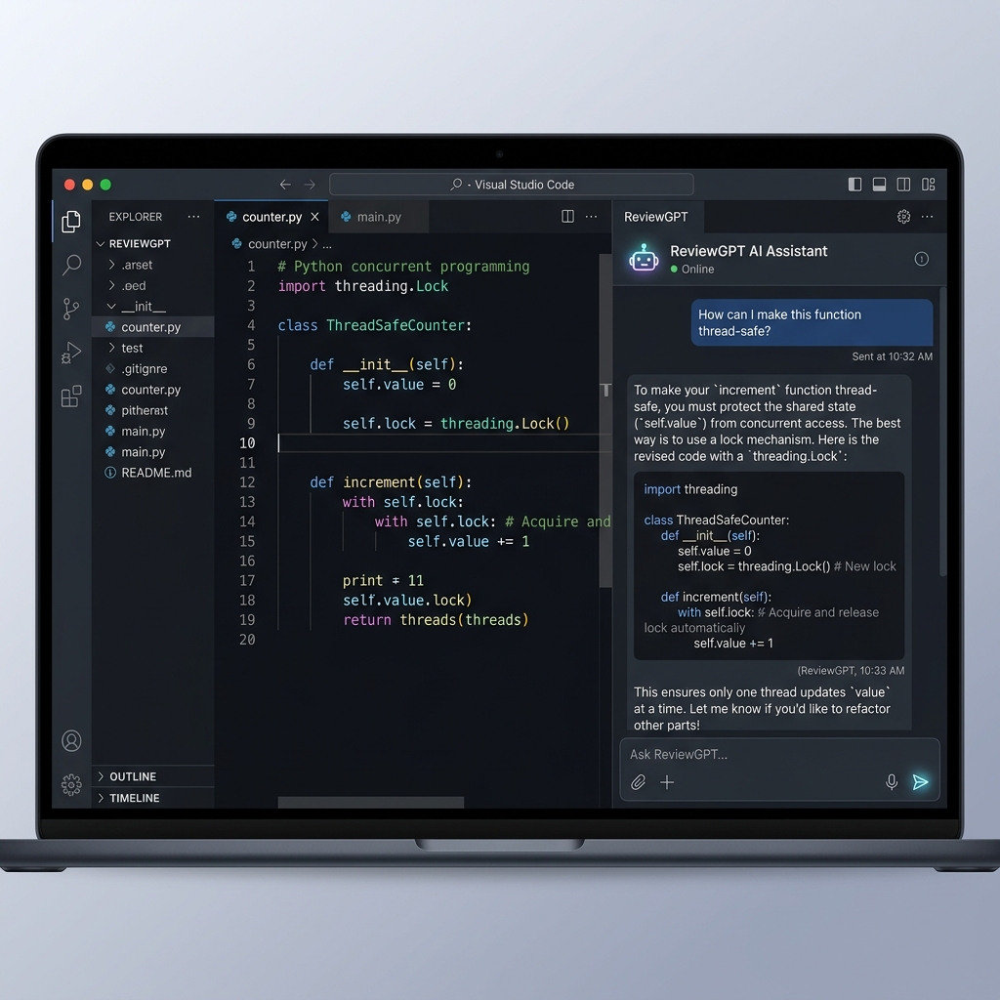

# 🚀 ReviewGPT – AI-Powered Code Review Platform

<p align="center">
  
  
  
  
  
</p>

## 🌟 Overview

ReviewGPT is an AI-powered GitHub repository analysis platform that performs automated code reviews using static analysis and Large Language Models.

The platform helps developers identify:

* 🐞 Bugs
* 🔒 Security Vulnerabilities
* ⚡ Performance Issues
* 📊 Cyclomatic Complexity
* 🧹 Code Quality Problems
* 🤖 AI-Powered Refactoring Suggestions

ReviewGPT combines GitHub repository analysis, FastAPI backend services, Gemini AI, and an interactive dashboard to provide actionable insights before code reaches production.

---

# 🌐 Live Demo

### 🔗 Live Application

https://ai-code-review-platform-tbdp.vercel.app

### 🔗 Github repository

https://github.com/srinathdoggala-tech/AI-Code-Review-Platform

### 🎥 Application Demo Video

Here is a short video walkthrough demonstrating the application scan flow, metrics dashboard, and AI chatbot assistant:

<video src="screenshots/demo.mp4" width="100%" controls></video>

---

# 📸 Screenshots

## Landing Page

Upload your repository and start scanning instantly.



---

## Repository Scanning

ReviewGPT analyzes repository structure and source code files.



---

## Code Health Dashboard

View overall repository quality and issue distribution.



---

## File Analysis

Analyze complexity scores and health metrics for individual files.



---

## AI Refactor Assistant

Receive AI-generated explanations and improvement suggestions.



---

# ✨ Features

## Repository Analysis

* Scan public GitHub repositories
* Repository structure analysis
* Branch-specific scanning
* GitHub API integration

## Bug Detection

Detect:

* Logical errors
* Boundary condition issues
* Runtime risks
* Poor coding practices

## Security Audits

Identify:

* Hardcoded credentials
* Sensitive information exposure
* SQL injection patterns
* XSS vulnerabilities
* Unsafe API usage

## Performance Analysis

Evaluate:

* Cyclomatic complexity
* Function complexity
* Performance bottlenecks
* Scalability concerns

## Code Quality Checks

Review:

* Maintainability
* Readability
* Architecture quality
* Coding standards

## AI Refactor Assistant

Powered by Gemini AI:

* Code explanations
* Refactoring recommendations
* Architecture improvements
* Best practice suggestions

---

# 🏗 Architecture

```text
GitHub Repository
        │
        ▼
Repository Scanner
        │
        ▼
Static Code Analyzer
        │
        ├──────────► Bug Detection
        │
        ├──────────► Security Audit
        │
        ├──────────► Complexity Analysis
        │
        ▼
Gemini AI Engine
        │
        ▼
AI Refactor Assistant
        │
        ▼
ReviewGPT Dashboard
```

# 🛠 Tech Stack

## Frontend

* React
* Vite
* Tailwind CSS
* JavaScript

## Backend

* FastAPI
* Python

## AI

* Google Gemini 2.5 Flash

## APIs

* GitHub REST API

## Deployment

* Vercel

---

# 📂 Project Structure

```bash
AI-Code-Review-Platform/
│
├── api/
│   ├── analyzer.py
│   ├── github_client.py
│   ├── index.py
│   └── main.py
│
├── public/
│
├── src/
│   ├── components/
│   ├── pages/
│   ├── services/
│   └── utils/
│
├── package.json
├── vite.config.js
├── vercel.json
└── README.md
```

# 🚀 Local Development

## Clone Repository

```bash
git clone https://github.com/srinathdoggala-tech/AI-Code-Review-Platform.git

cd AI-Code-Review-Platform
```

## Install Frontend Dependencies

```bash
npm install
```

## Start Frontend

```bash
npm run dev
```

Frontend:

```text
http://localhost:5173
```

## Backend Setup

Navigate to API folder:

```bash
cd api
```

Create virtual environment:

### Windows

```bash
python -m venv venv

venv\Scripts\activate
```

### macOS/Linux

```bash
python3 -m venv venv

source venv/bin/activate
```

Install dependencies:

```bash
pip install -r requirements.txt
```

Run FastAPI server:

```bash
uvicorn main:app --reload
```

Backend:

```text
http://127.0.0.1:8000
```

---

# ⚙ Environment Variables

Create a `.env` file inside the api directory.

```env
GEMINI_API_KEY=YOUR_GEMINI_API_KEY
```

---

# 🚀 Deployment

## Vercel Deployment

1. Fork or clone this repository
2. Login to Vercel
3. Import Project
4. Add environment variable:

```env
GEMINI_API_KEY=YOUR_GEMINI_API_KEY
```

5. Click Deploy

Vercel automatically:

* Builds React frontend
* Deploys FastAPI serverless functions
* Configures API routing

---

# 📈 Example Analysis Output

ReviewGPT provides:

* Repository Health Score
* Bug Count
* Security Findings
* Performance Metrics
* Complexity Analysis
* AI Refactoring Suggestions

Example:

```text
Health Score: 85/100

Bugs Found: 7

Security Issues: 1

Performance Issues: 3

Code Quality Findings: 15
```

---

# 🎯 Use Cases

### Developers

Review code before deployment.

### Students

Learn best coding practices.

### Open Source Contributors

Understand unfamiliar repositories quickly.

### Startup Teams

Improve code quality and maintainability.

### Technical Interview Preparation

Analyze projects and identify improvements.

---

# 🔮 Future Roadmap

* GitHub OAuth Authentication
* Pull Request Analysis
* Commit-Level Review
* Multi-Repository Dashboards
* PDF Report Export
* Team Collaboration Features
* CI/CD Integration
* GitHub Actions Support
* Slack Notifications

---

# 🤝 Contributing

Contributions are welcome.

```bash
Fork Repository

Create Feature Branch

Commit Changes

Push Branch

Open Pull Request
```

---

# 📄 License

This project is licensed under the MIT License.

---

# 👨‍💻 Author

### Srinath Doggala

Computer Science Engineering (AI/ML)

GitHub:
https://github.com/srinathdoggala-tech

Project:
https://ai-code-review-platform-tbdp.vercel.app

---

⭐ If you found this project useful, consider starring the repository.
